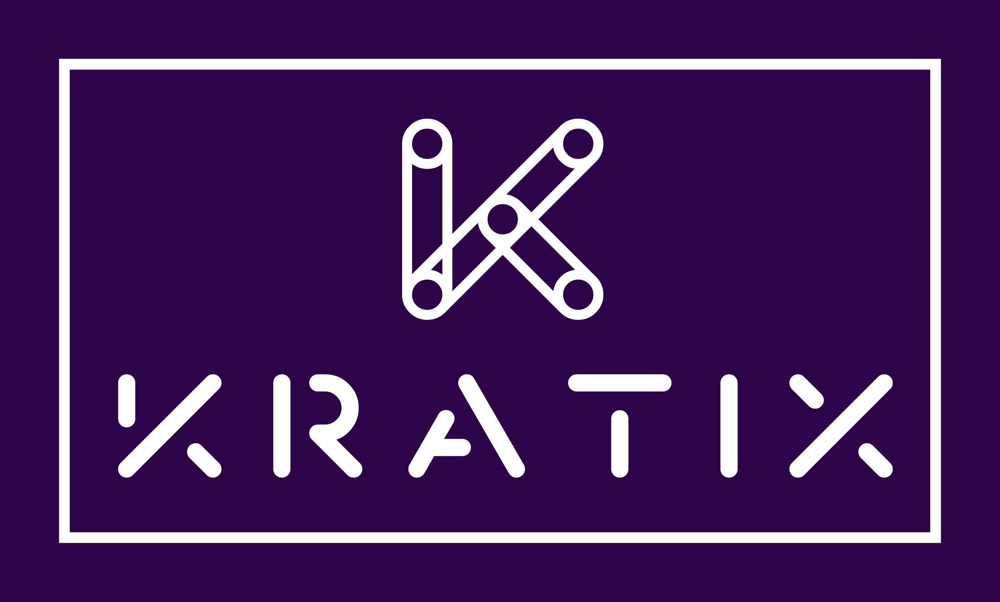

# Kratix

κρατήστε μια υπόσχεση | *kratíste mia ypóschesi* | **Keep a promise**

## What is Kratix?

Kratix is a framework for building Platform-as-a-Product. Kratix enables platform teams to easily deliver a curated Kubernetes-native platform API, over fleets of Kubernetes clusters, to increase flow across your organisation. 

Kratix is deployed to a "platform" cluster, and uses the GitOps Toolkit to orchestrate a  topology of "worker" clusters. The Kratix installation is then loaded with "Promises" to create a rich platform API. Each "Promise" is a definition of an on-demand service.

### Contents
- Context
  - [Value of Kratix](./docs/kratix-value.md) 
  - [Crossing the Platform Gap](https://www.syntasso.io/post/crossing-the-platform-gap) 
  <!-- - [Personas](./docs/personas.md)  -->
  <!-- - [Team Story](./docs/success.md) -->
  <!-- - [Architecture](./docs/writing-a-promise.md) -->
- Deploying Kratix
  - [Quick Start](./docs/quick-start.md)
  - [Detailed Installation](./docs/detailed-start.md)
  - [Promise Samples](./docs/promise-samples.md)
- Promises
  - [What is a Promise?](./docs/promises.md)
  - [Writing a Promise](./docs/writing-a-promise.md)
  - [Promise Samples](./docs/promise-samples.md)
- [How Kratix Compares to Other Technologies in the Ecosystem](./docs/compare.md)
- [FAQs](docs/FAQ.md)
- [Known issues](./docs/known-issues.md)  

**[Work with Kratix's originators, Syntasso, to deliver your organisation's Platform-as-a-Product.](https://www.syntasso.io/how-we-help)**

### **Give feedback on Kratix**
  - [Via email](mailto:feedback@syntasso.io?subject=Kratix%20Feedback)
  - [Google Form](https://forms.gle/WVXwVRJsqVFkHfJ79)
