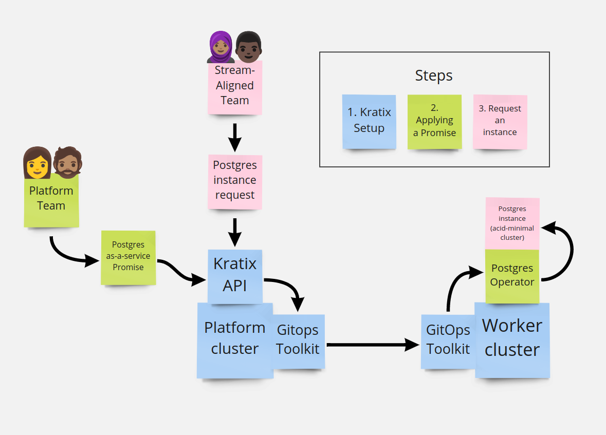

# Kratix

κρατήστε μια υπόσχεση

*kratíste mia ypóschesi*

**Keep a promise**

Kratix is a framework for delivering platforms. A platform team deploys Kratix on Kubernetes clusters, adds valuable functionality in the form of "Promises", and sustainably grows their platform over time by adding and adapting Promises in response to user needs.

- [The Problem Kratix Solves](#the-problem-kratix-solves)
- [Getting Started](#getting-started)
- [Where Next?](#where-next)
- [Known Issues](#known-issues)

## The Problem Kratix Solves

See the ["Crossing the Platform Gap" article on Syntasso.io](https://www.syntasso.io/post/crossing-the-platform-gap).

- **[Work with Kratix's originators, Syntasso, to deliver your organisation's Platform-as-a-Product.](https://www.syntasso.io/how-we-help)**

## Getting Started

In order to understand the power of internal platforms, let's build a demonstration platform using Kratix!

First, we're going to assume the role of a platform team member. We're going to create an internal platform for our SATs. Our first step is to create a "platform" Kubernetes cluster to host our internal platform, and install Kratix on our platform cluster to power our platform API. We're now ready to add functionality to our platform.

Next, we will create a "worker" Kubernetes cluster to host the workloads delivered, X-as-a-Service, to our SATs. It is possible to add as many clusters as you wish to Kratix, and to dynamically create new clusters when desired, but right now we'll stick with one worker cluster for demonstration purposes. We'll also configure our worker cluster to join the platform cluster's Kratix topology. We're now ready to host workloads for our SATs.

Then we're going to add a sample Postgres Promise to our Kratix-powered platform API, so our SATs can request instances of Postgres "on demand" from our platform. The Postgres Promise encapsulates the knowledge of:
- The information the platform team needs to know from the SAT to create a PostGres instance on-demand (name, databases, etc).
- Which resources need to be present on the worker cluster to host instances (the Postgres operator).
- How to security check, scan, validate, and mutate etc. from the SAT's instance request to a set of per-instance Kubernetes resources to be applied on the worker cluster (a simple yaml transformation in this example).
The Promise enables the platform team to promise an organisationally-relevant Postgres service - or whichever services are of value in their platform - to the SATs, and to keep their promise.

Lastly, we're going to assume the role of a SAT member, make a request to the platform API for an instance of Postgres, and watch the instance get created in real time on the worker cluster. Postgres is now delivered X-as-a-service from the platform team to our SATs.

### Quick Start

We recommend that you follow the tutorial below to see the power of Kratix's multi-cluster deployment capabilities. We understand that some users require a simpler getting started experience. For those who wish to deploy Kratix in "single-cluster" mode, or a non-KinD installation, follow [this guide](docs/single-cluster.md).

### Prerequisites
- A reasonably powerful computer. We test on:
    - Linux(Mint), i7, 16GB, KinD on native Docker.
    - Mac, i7, 32GB, KinD on a Docker Desktop VM(6 vCPU / 24GB).
- Install Kubernetes-in-Docker(KinD). See [the quick start guide](https://kind.sigs.k8s.io/docs/user/quick-start/). Tested on 0.9.0 and 0.10.0. See the [Quick Start](docs/single-cluster.md) for non-KinD installations.
    - Ensure no KinD clusters are currently running. `kind get clusters` should return "No kind clusters found."
- Install Kubectl. See [the install guide](https://kubernetes.io/docs/tasks/tools/#kubectl). Tested on 1.16.13 and 1.21.2.

### Clone Kratix
* `git clone git@github.com:Syntasso/kratix.git`

### Setup Platform Cluster and Install Kratix


This will create our platform cluster and install Kratix. We'll also install Minio to power our GitOps pipelines to the worker clusters. For production installations, Git or S3 can easily be used instead, depending on your preference.

* `kind create cluster --name platform`
* `kubectl apply -f distribution/kratix.yaml`
* `kubectl apply -f hack/platform/minio-install.yaml`

The Kratix API should now be available.

* `kubectl get crds`

```
NAME                                     CREATED AT
promises.platform.kratix.io              2021-09-03T11:59:16Z
works.platform.kratix.io                 2021-09-03T11:59:16Z
```

### Setup Worker Cluster

This will create a cluster for running the X-as-a-service workloads, and install GitOps Toolkit components to continuously converge the worker cluster on the desired state.

* `kind create cluster --name worker`
* `kubectl apply -f hack/worker/gitops-tk-install.yaml`
* `kubectl apply -f hack/worker/gitops-tk-resources.yaml`

Once Flux is installed and running (this may take a few minutes), the Kratix resources should now be visible on the worker cluster.

* `kubectl get ns kratix-worker-system`
```
NAME                   STATUS   AGE
kratix-worker-system   Active   4m2s
```

### Apply Postgres-as-a-Service Promise on the Platform Cluster


Now we have Kratix available to power our platform API, we need to put it to good use. We should spend time with our SATs to understand their needs, combine those needs with the organisation's needs around security, governance, and compliance, and encode this knowledge in a Promise. For the purpose of this walkthrough let's install the provided Postgres-as-a-service Promise.

* `kubectl config use-context kind-platform`
* `kubectl apply -f samples/postgres/postgres-promise.yaml`

We should now see that our platform cluster offers the ability to create Postgres instances.

* `kubectl get crds postgreses.example.promise.syntasso.io`

```
NAME                                     CREATED AT
postgreses.example.promise.syntasso.io   2021-09-03T12:02:20Z
```

### Review created Postgres cluster-scoped resources on the Worker Cluster

If we examine the worker cluster, after our configuration has been applied (may take a few moments), we see that the cluster-level resources necessary to host Postgres instances (the operator) have been deployed. Also notice that there are currently zero Postgres instances.

* `kubectl config use-context kind-worker`
* `kubectl get pods`
```
NAME                                 READY   STATUS    RESTARTS   AGE
postgres-operator-55b8549cff-s77q7   1/1     Running   0          51s
```

### Request a Postgres Instance on the Platform Cluster



We now assume the role of a member of a stream-aligned team, and request a Postgres server from the platform API.

* `kubectl config use-context kind-platform`
* `kubectl apply -f samples/postgres/postgres-resource-request.yaml`

We can see the request on the platform cluster.

* `kubectl get postgreses.example.promise.syntasso.io`
```
NAME                   AGE
acid-minimal-cluster   27s
```

### Review created Postgres Instance on the Worker Cluster

Once the GitOps Toolkit has applied the new configuration to the worker cluster (this may take a few moments), the Postgres instance will be created.

* `kubectl config use-context kind-worker`
* `kubectl get pods`
```
NAME                                 READY   STATUS    RESTARTS   AGE
acid-minimal-cluster-0               1/1     Running   0          94s
acid-minimal-cluster-1               1/1     Running   0          58s
postgres-operator-55b8549cff-s77q7   1/1     Running   0          2m46s
```

### What have we learned?

We created an internal platform API, and a worker cluster to host workloads for our stream-aligned teams. We then decorated our platform API by Promising Postgres-as-a-service. Finally, we adopted the role of a stream-aligned team member and requested a Postgres instance from the platform. The Postgres instance was created on the worker cluster.

## Where Next?
- Try the [Kpack-and-Knative Application Stack](https://github.com/Syntasso/kratix/tree/main/samples/appstack) to see a Promise comprising multiple elements of underlying software.
- Try out the other Promise samples.
    - [Machine Learning with Kubeflow Pipelines](https://github.com/Syntasso/kratix/tree/main/samples/kubeflow-pipelines)
    - [Messaging with RabbitMQ](https://github.com/Syntasso/kratix/tree/main/samples/amqp)
    - [CI/CD with Jenkins](https://github.com/Syntasso/kratix/tree/main/samples/jenkins)
- [Author your own Promises](docs/writing-a-promise.md) to extend your platform API with bespoke services for your organisation.
- [Review the Frequently Asked Questions](docs/FAQ.md)
- **Give feedback on Kratix Please, please, please!**
  - [Via email](mailto:feedback@syntasso.io?subject=Kratix%20Feedback)
  - [Google Form](https://forms.gle/WVXwVRJsqVFkHfJ79)
- **[Work with Kratix's originators, Syntasso, to deliver your organisation's Platform-as-a-Product.](https://www.syntasso.io/how-we-help)**

## Known Issues
- Very large (in terms of bytes of yaml) Promises may fall foul of Kubernetes's annotations size limit when using `kubectl apply`. A workaround is to use `kubectl create`. We will address this in the future with dependency management between Promises.
- The demonstration installation relies upon the platform cluster running on `172.18.0.2` and making Minio available on port `31337` to the worker cluster. This works on default settings but may conflict with custom installations.
- The demonstration installation exercises the "happy path" only. Any functionality beyond setup, applying a Promise, and creating an instance, is untested.
