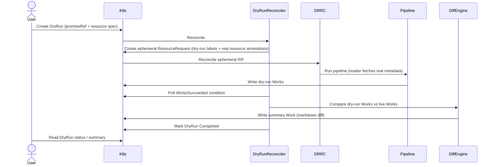
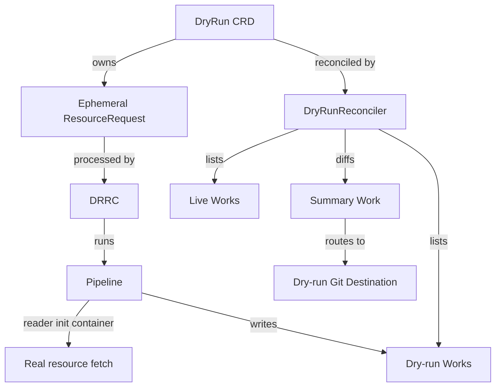

# Dry Run Prototype Summary

## What Was Built

A prototype of a first-class `DryRun` CRD for Kratix. Instead of running a pipeline that writes to a real state store, a dry run executes the same pipeline against an ephemeral resource request, captures the resulting Works, and produces a diff showing what would change.

### Overview

### Components

### Key design decisions

**Ephemeral ResourceRequest.** The DryRunReconciler creates a short-lived RR owned by the DryRun (cascade delete). It carries the `kratix.io/dry-run` label so existing pipeline machinery runs unchanged, and annotations with the real resource coordinates so the pipeline can find them.

**Reader-level metadata injection.** The reader init container (which writes `object.yaml` for the pipeline) detects the dry-run environment variable, reads the real resource annotations off the ephemeral RR, fetches the real resource from the API, and merges its metadata with the proposed spec. This means the pipeline sees the correct name, namespace, and labels, but the spec it is evaluating is the proposed one.

**Works-based diff.** Rather than intercepting pipeline output at the file level, the DryRunReconciler waits for Works to be written (the same signal used to determine pipeline success), then compares dry-run Works against live Works grouped by pipeline. The result is a GitHub-compatible unified diff rendered as markdown.

**DRRC guard.** A one-line change to the Dynamic Resource Request Controller prevents it from treating dry-run ephemeral RRs as candidates for the existing dry-run summary path.

**GitHub Actions agent.** A composite action creates the DryRun object, polls for completion, then surfaces the summary diff in the pull request.

---

## What Was Not Explored

- **Tests.** No unit or integration tests were written. The implementation is manually tested only.
- **Multiple Destinations.** Works can target multiple Destinations. The diff currently aggregates all workloads regardless of destination; which destination each file would land in is not shown.
- **Promise-level pipelines.** Only resource-request pipelines were considered. Promise-level pipelines (dependencies) are not handled.
- **Cluster-scoped resources.** The reader fetches the real resource using the namespace from the annotation. Cluster-scoped resources have no namespace, which would need special handling.
- **In-progress status.** The DryRun status only has a final `Completed` condition (true or false). There is no intermediate status while the pipeline is running.
- **Timeouts.** If the pipeline never reaches `WorksSucceeded`, the DryRunReconciler requeues indefinitely. A timeout and failure condition are needed.
- **Security model.** A user who can create a DryRun can trigger a pipeline execution. No additional RBAC beyond the existing resource-request RBAC was considered.
- **Shallow spec merging.** The reader replaces the entire `spec` field of the ephemeral RR with the proposed spec. Any defaults or mutations applied by admission webhooks on the real resource are not reflected.
- **CI agent maturity.** The GitHub Actions action is minimal: it creates the DryRun, polls with a fixed interval, and prints the summary. Error handling and retry logic are basic.

---

## Feasibility Assessment

Dry runs are feasible. The core mechanism (ephemeral RR + Works diff) works end-to-end and the changes required to existing components are small. The pipeline runs unchanged; only the reader init container is aware of the dry-run context.

The main challenges for a production implementation are:

1. **Multi-Destination routing.** The diff needs to show not just which files change, but which Destination each file targets. This requires understanding WorkloadGroup scheduling at diff time.

2. **Security.** Creating a DryRun should require at minimum the same permissions as creating a real ResourceRequest for that Promise. An admission webhook or controller-side validation is needed.

3. **Test coverage.** The DRRC and DryRunReconciler interaction, the reader metadata injection, and the diff rendering all need proper unit and integration tests before this could ship.

Everything else (CRD schema, controller registration, RBAC, reader change, summary routing) is straightforward and already working.
