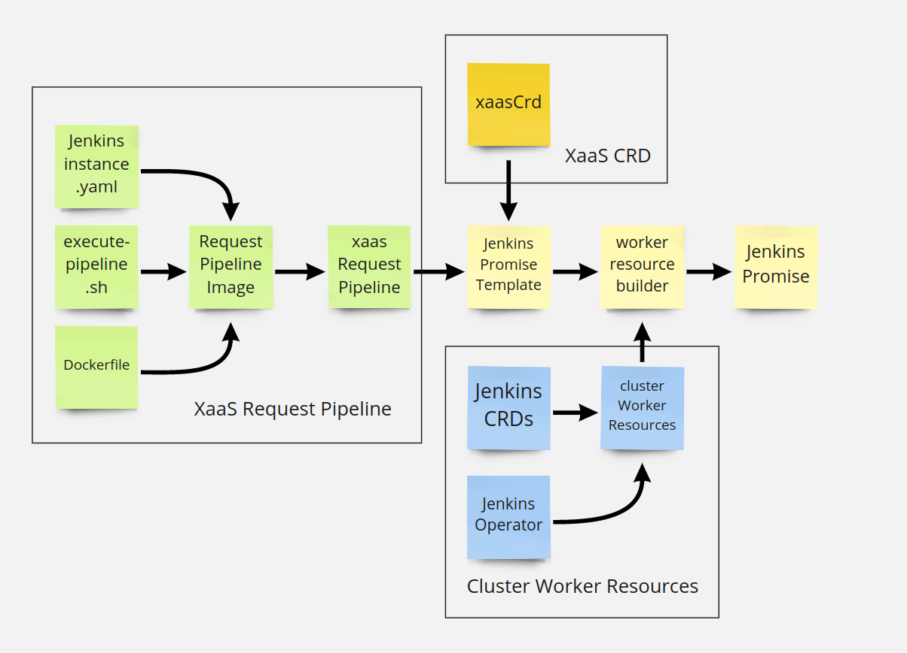

# Writing your own promise

- [Writing your own promise](#writing-your-own-promise)
  - [What will I learn?](#what-will-i-learn)
  - [Writing a Promise](#writing-a-promise)
    - [Prerequisites:](#prerequisites)
    - [Promise basics](#promise-basics)
    - [Promise template](#promise-template)
    - [X-as-a-Service Custom Resource Definition](#x-as-a-service-custom-resource-definition)
    - [X-as-a-Service Request Pipeline](#x-as-a-service-request-pipeline)
    - [Worker Cluster Resources](#worker-cluster-resources)
    - [Create and submit a resource request](#create-and-submit-a-resource-request)
  - [Summary](#summary)
  - [Where Next?](#where-next)

## What will I learn?
We will walk through the steps needed to create your own Promise, configure it for your needs, decorate it with your own opinions, and expose it as-a-Service ready for consumption by your platform users. If you are unsure of what a promise is and what problem it solves, check out [this page](promises.md).

You will learn how to:
* Build a Promise for complex software, and expose it via a simple custom API which captures the data needed from users to configure the Promise for consumption "as-a-Service".
* Wrap and deploy the underlying Kubernetes CRDs, Operators, and resources required to run your Promise.
* Create a Promise pipeline to inject captured user-data into the underlying Kubernetes resources, and decorate the Promised software with custom behavior so the running Promise reflects your organisational and users' requirements.

## Writing a Promise


### Prerequisites:
1. [Install Kratix across 2 Kind clusters](../README.md)
2. Install Kubernetes-in-Docker(KinD). See [the quick start guide](https://kind.sigs.k8s.io/docs/user/quick-start/). Tested on 0.9.0 and 0.10.0.
    - Ensure no KinD clusters are currently running. `kind get clusters` should return "No kind clusters found."
3. Install Kubectl. See [the install guide](https://kubernetes.io/docs/tasks tools/#kubectl). Tested on 1.16.13 and 1.21.2.
4. A Docker Hub account with push permissions (or similar registry).
5. [The Docker cli](https://docs.docker.com/get-docker/) -- to build and push images.

To begin writing a Promise we will need a basic directory structure to work in.

 ```
mkdir -p jenkins-promise/{resources,request-pipeline-image}
cd jenkins-promise
```

### Promise basics
Conceptually a Promise consists of three parts:

1. `xaasCrd`: this is the CRD that is exposed to the users of the Promise. Imagine the order form for a product. What do you need to know from your customer? Size? Location? Name?
2. `xaasRequestPipeline`: this is the pipeline that will create the Jenkins resources requried to run Jenkins on a worker cluster decorated with whatever you need to run Jenkins from your own Platform. Do you need to scan images? Do you need to send a request to an external API for approval? Do you need to inject resources for storage, mesh, networking, etc.? These activities happen in the pipeline.
3. `workerClusterResources`: this contains all of the Kubernetes resources required on a cluster for it to be able to run an instance Jenkins such as CRDs, Operators and Deployments. Think about the required prerequisites necessary on the worker cluster, so that the resources declared by your pipeline are able to converge.


### Promise template

Create a basic `jenkins-promise-template.yaml` to work with:

```bash
cat > jenkins-promise-template.yaml <<EOF
apiVersion: platform.kratix.io/v1alpha1
kind: Promise
metadata:
  name: jenkins-promise
spec:
  #injected via: go run path/to/kratix/hack/worker-resource-builder/main.go -k8s-resources-directory ${PWD}/resources -promise ${PWD}/jenkins-promise-template.yaml > jenkins-promise.yaml
  #workerClusterResources:
  xaasRequestPipeline:
  xaasCrd:
EOF
```

We will fill the `spec` scalars as we progress through the tutorial.

### X-as-a-Service Custom Resource Definition
This is the user-facing API. For the purpose of this tutorial we will create an API that accepts a single `string` parameter called `name`. This API can be as complex or as simple as you design it to be.


Add the below to the `xaasCrd` scalar in `jenkins-promise-template.yaml`. Ensure the indentation is correct (`xaasCrd` is nested under `spec`).

```yaml
  xaasCrd:
    apiVersion: apiextensions.k8s.io/v1
    kind: CustomResourceDefinition
    metadata:
      name: jenkins.promise.example.com
    spec:
      group: promise.example.com
      scope: Namespaced
      names:
        plural: jenkins
        singular: jenkins
        kind: jenkins
      versions:
      - name: v1
        served: true
        storage: true
        schema:
          openAPIV3Schema:
            type: object
            properties:
              spec:
                type: object
                properties:
                  name:
                    type: string
```

We have now created our as-a-Service API.

### X-as-a-Service Request Pipeline
Next we will build the pipeline required to transform a Promise request into the Kubernetes resources required to create a running instance of the Promised service.

The `xaasRequestPipeline` is an array of container images that execute in a defined order. Each Docker image can take on a single responsibility required for the creation of the service. We will create a step that takes the `name` parameter -- as defined in the previous tutorial stage -- and pass it into the Jenkins Custom resource.

The contract with each container is simple and straightforward:
- The first container in the list receives the resource created by the user when they applied their request. This document, by definition, will be a valid Kubernetes resource as defined by the `xaasCrd`. The document will be available in `/input/object.yaml`.
- The container's command then executes, using the input object, and fulfilling any responsibilites necessary.
- The container writes any resources to be created to `/output/`.
- The resources in `/output` of the last container in the `xaasRequestPipeline` array will be scheduled and applied to the appropriate worker clusters.

In more advanced Promises, each of these 'stages' will take on responsibilities such as vulnerability scanning, licence checking, and secure certificate injection; the possibilities are endless. Look out for partnerships in this space to provide integrations for common services and tooling.


`cd request-pipeline-image`

Create the <code>jenkins-instance.yaml</code> by running the below command.
<details>
<summary><b>Note:</b> the code is folded for brevity</summary>

```bash
cat > jenkins-instance.yaml <EOF
apiVersion: jenkins.io/v1alpha2
kind: Jenkins
metadata:
  name: <tbr-name>
  namespace: default
spec:
  configurationAsCode:
    configurations: []
    secret:
      name: ""
  groovyScripts:
    configurations: []
    secret:
      name: ""
  jenkinsAPISettings:
    authorizationStrategy: createUser
  master:
    disableCSRFProtection: false
    containers:
      - name: jenkins-master
        image: jenkins/jenkins:2.277.4-lts-alpine
        imagePullPolicy: Always
        livenessProbe:
          failureThreshold: 12
          httpGet:
            path: /login
            port: http
            scheme: HTTP
          initialDelaySeconds: 100
          periodSeconds: 10
          successThreshold: 1
          timeoutSeconds: 5
        readinessProbe:
          failureThreshold: 10
          httpGet:
            path: /login
            port: http
            scheme: HTTP
          initialDelaySeconds: 80
          periodSeconds: 10
          successThreshold: 1
          timeoutSeconds: 1
        resources:
          limits:
            cpu: 1500m
            memory: 3Gi
          requests:
            cpu: "1"
            memory: 500Mi
  seedJobs:
    - id: jenkins-operator
      targets: "cicd/jobs/*.jenkins"
      description: "Jenkins Operator repository"
      repositoryBranch: master
      repositoryUrl: https://github.com/jenkinsci/kubernetes-operator.git
EOF
```
</details>


Kratix takes no opinion on the tooling used within a pipeline. Kratix will pass a set of resources to the pipeline, and expect back a set of resources. What happens within the pipeline, and what tooling is used, is a decision left entirely to the promise author. As our pipeline is simple (we're taking a name from the Promise custom resource input, and passing it to the Jenkins custom resource output) we're going to keep-it-simple and use a combination of `sed` and `yq` to do our work.

```bash
cat > execute-pipeline.sh <<EOF
#!/bin/sh
#Get the name from the Promise Custom resource
instanceName=\$(yq eval '.spec.name' /input/object.yaml)

# Inject the name into the Jenkins resources
find /tmp/transfer -type f -exec sed -i \\
  -e "s/<tbr-name>/\${instanceName//\//\\/}/g" \\
  {} \;

cp /tmp/transfer/* /output/
EOF
```
Then make it executable:

```bash
chmod +x execute-pipeline.sh
```

Next, we create a simple `Dockerfile` that will copy our `jenkins-instance.yaml` doc into Kratix where it can be amended by our `execute-pipeline.sh` script and passed to the Worker cluster ready for execution.

```bash
cat > Dockerfile <<EOF
FROM "mikefarah/yq:4"
RUN [ "mkdir", "/tmp/transfer" ]

ADD jenkins-instance.yaml /tmp/transfer/jenkins-instance.yaml
ADD execute-pipeline.sh execute-pipeline.sh

CMD [ "sh", "-c", "./execute-pipeline.sh"]
ENTRYPOINT []
EOF
```

Next you will need to run
```bash
docker build . --tag <your-org-name/name-of-your-image>
```

We can test our container image by supplying an input resource and examining the output resource.

Let's create the test input and output directories locally.

```bash
mkdir {input,output}
```

The /input directory is where user resource request will be written when a user applies a resource to the Custom Resource Definition (`xaasCrd`) in the Promise (see above).

We need to add a sample user resource request to the /input directory:

```bash
cat > input/object.yaml <<EOF
apiVersion: promise.example.com/v1
kind: jenkins
metadata:
  name: my-jenkins-promise-request
spec:
  name: my-amazing-jenkins
EOF
```

Now we can run our container and examine the output.

```bash
docker run -v ${PWD}/input:/input -v ${PWD}/output:/output <your-org-name/name-of-your-image>
cat output/*
```

The contents of the /output directory will be scheduled and deployed by Kratix to a worker cluster. They need to be valid Kubernetes resources that can be applied to any cluster with the Promise's `workerClusterResources` installed (see beneath).

*If we already have the "Worker Cluster Resources" installed on a test cluster, we can optionally apply the resources in the /output directory and test to see if the Jenkins instance is created. This provides a fast feedback loop for developing a Promise. Continue to iterate on the container image, and running the image with input+output directories as above, until the files created in /output have the desired result when applied to a cluster with the worker cluster resources installed.*

Once we are satisified with the image, we can push it so it's ready for use in our pipeline.
```bash
docker push <your-org-name/name-of-your-image>
```

The final step of creating the `xaasRequestPipeline` is to add the  `spec.xaasRequestPipeline` scalar in `jenkins-promise-template.yaml` making sure you add the correct image details.

Let's move back to our "jenkins-promise" directory.

```bash
cd ..
```

And add the image to the array in `jenkins-promise-template.yaml`.

```yaml
xaasRequestPipeline:
    - <your-org-name/name-of-your-image>
```

XaasRequestPipeline Summary

We have:
- Created a container image containing:
    - A template file to be injected with per-instance details (jenkins-instance.yaml)
    - A shell script to retrieve the per-instance details from the user's request, and inject them into the template (execute-pipeline.sh)
    - A command set to the shell script
- Created a set of directories(input/output) and sample user request(input/object.yaml)
- Executed our pipeline image locally as a test
- Pushed our image to our registry
- Added the image to our Promise definition in the `xaasRequestPipeline` array

*Please note: at time of writing, only the first image in the `xaasRequestPipeline` array will be executed. Multiple image functionality will be available soon.*


### Worker Cluster Resources



 Jenkins.io has a [great Operator](https://jenkinsci.github.io/kubernetes-operator/docs/getting-started/latest/installing-the-operator/) that ships in two files.
1. [Jenkins CRDs](https://raw.githubusercontent.com/jenkinsci/kubernetes-operator/master/config/crd/bases/jenkins.io_jenkins.yaml)
2. [The Operator](https://raw.githubusercontent.com/jenkinsci/kubernetes-operator/master/deploy/all-in-one-v1alpha2.yaml) and other required resources such as Service Accounts, Role Bindings and Deployments.

We will need to download both.
```
wget https://raw.githubusercontent.com/jenkinsci/kubernetes-operator/master/config/crd/bases/jenkins.io_jenkins.yaml -P resources
wget https://raw.githubusercontent.com/jenkinsci/kubernetes-operator/master/deploy/all-in-one-v1alpha2.yaml -P resources
```

Next we need to inject Jenkins files into our `jenkins-promise-template.yaml`. To make this step simpler we have written a _very basic_ tool to grab all YAML documents from all YAML files located in `resources` and inject them into the `workerClusterResources` scalar.

```
go run path/to/kratix/hack/worker-resource-builder/main.go \
  -k8s-resources-directory ${PWD}/resources \
  -promise ${PWD}/jenkins-promise-template.yaml > jenkins-promise.yaml
```

This will create the finished `jenkins-promise.yaml` which can now be applied to the Kratix platform cluster:

```
kubectl apply --context kind-platform -f jenkins-promise.yaml
```

after a few seconds we can run `kubectl --context kind-platform get crds` and we should see something like:
```bash
NAME                          CREATED AT
jenkins.promise.example.com   2021-09-09T11:21:10Z
```

The complexities of what happens when installing a Promise are beyond this tutorial, but it's good to understand that a k8s Controller is now responding to Jenkins resource requests on the Platform cluster.

After a few minutes we can go to the Worker cluster and see we have a Jenkins operator running.

`kubectl --context=kind-worker get pods -A`

See a Jenkins Operator.

### Create and submit a resource request


Next, we change hats from Platform team member and become the customer of the Platform team. We should now be able to request instances of Jenkins on-demand.

```bash
cat > jenkins-resource-request.yaml <<EOF
apiVersion: promise.example.com/v1
kind: jenkins
metadata:
  name: my-jenkins-promise-request
spec:
  name: my-amazing-jenkins
EOF

kubectl apply --context kind-platform -f jenkins-resource-request.yaml
```

After a few minutes the Jenkins operator will have received the request and asked the k8s worker to start an instance of Jenkins. We can target the Worker cluster (`kubectl config use-context kind-worker`) and run `kubectl get pods -A` to see our Jenkins instance with the defined name of `jenkins-my-amazing-jenkins`! (The Jenkins operator prepends the instance name with `jenkins-` hence `jenkins-my-amazing-jenkins`)

We can see the Jenkins UI in our browsers (all commands on worker cluster):
1. Get the username: `kubectl get secret jenkins-operator-credentials-my-amazing-jenkins -o 'jsonpath={.data.user}' | base64 -d`
2. Get the password: `kubectl get secret jenkins-operator-credentials-my-amazing-jenkins -o 'jsonpath={.data.password}' | base64 -d`
3. `kubectl port-forward jenkins-my-amazing-jenkins 8080:8080`
4. Navigate to http://localhost:8080

## Summary

We built a Jenkins-as-a-Service offering, by creating a Jenkins Promise, and adding the Promise to our Kratix platform.

We created the three elements of a Promise for Jenkins:
- `xaasCrd`
- `xaasRequestPipeline`
- `workerClusterResources`

and added them to our single Jenkins Promise yaml document. We then applied our Jenkins Promise to our platform cluster, which created the Jenkins-as-a-Service API, and configured our worker cluster such that it could create and manage Jenkins instances. Lastly, we assumed the role of our customer, and applied a yaml document to our Platform cluster, triggering the creation of a Jenkins instance on the Worker cluster.

## Where Next?

Create your own Promises for the customers of your platform. Where they may be useful to others, share them! Public repository information will be available in the future.
